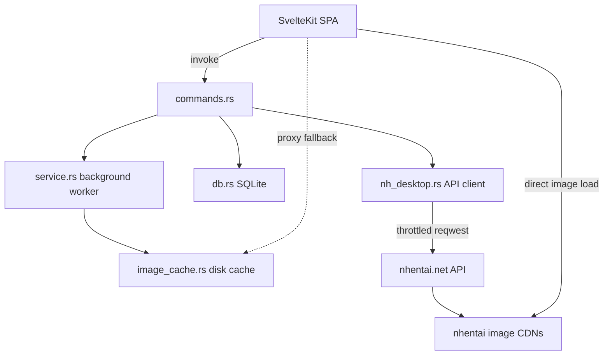

# NH Reader

**A lightweight, modern, cross-platform client for [nhentai.net](https://nhentai.net).**

NH Reader is not a web wrapper. It is a native desktop and mobile application with its **own custom UI** and a
materially better **search & filter** and **global blacklist** experience than the site provides.
It imports as much data as the site's API makes available — galleries, tags, languages,
categories, artists, characters, parodies — and lets you slice it **locally, instantly**.

> **18+ only.** This application is intended for adults only. By using it you confirm that you
> are of legal age in your jurisdiction to view adult content.

---

## ✨ Highlights

- 🔍 **Search that actually works.** A filter drawer covers text, language, category, per-type tag
  include/exclude (artist, character, parody, group, …), page-count ranges, and six sort modes —
  compiled into native nhentai query syntax (`language:english`, `-tag:...`, `pages:>50`).
- **A blacklist you can trust.** Global, persistent, applied **server-side** (query `-tag:`
  excludes) *and* **client-side** (hide/blur in grids), with a master toggle. It never silently
  breaks the grid or the reader.
- **Native and fast.** Tauri 2 (Rust `reqwest`) backend, native OS window decorations with an in-app top bar, SvelteKit SPA frontend with Svelte 5 runes. Everything runs locally; images load lazily with a Rust image-proxy fallback (backed by a disk cache) when the CDN 404s.
- **Official archive downloads.** Adopts nhentai API v2's dedicated archive endpoint (`POST /api/v2/galleries/{id}/download`) to fetch pre-built zip/cbz archives directly instead of walking CDN page URLs.
- **Background jobs built in.** Gallery downloads, image prefetch, cache/account maintenance, and an optional Popular auto-refresh run in a throttled background service with live progress. Launching the app again on desktop focuses the running window (single instance).
- **Private & versatile account sync.** Favorites, history, blacklist, and settings live locally on your device in SQLite (`database.sqlite`). An optional account sign-in modal supports both official API Keys (bypasses Cloudflare CAPTCHAs) and direct credentials, powering live profile display and synchronized blacklists.
- **Mihon-inspired floating navigation.** Modern thumb-friendly floating navigation bar with a 4px corner radius, backdrop blur elevation, and responsive full-width page-fitting settings layouts.
- **Speaks your language.** Interface defaults to your system locale and can be chosen in Settings. English is shipped out of the box with simple 100% drop-in JSON files for community-contributed translations.
- **Native installers & mobile packaging.** Native NSIS (both per-user and per-machine) and WiX MSI on Windows, DMG on macOS, deb/AppImage on Linux, APK on Android, and sideloadable iOS targets.

## 🖥️ Platforms

| Platform | Support |
| --- | --- |
| Windows 10+ | ✅ Supported (NSIS installer, WiX MSI, portable zip) |
| macOS 10.13+ | ⚠️ Toolchain supported (untested due to lack of macOS hardware) |
| Linux (x86_64) | ✅ Supported (deb, AppImage) |
| Android | ⚠️ Toolchain supported (currently untested due to lack of physical Android device) |
| iOS | ⚠️ Toolchain supported (currently untested due to lack of macOS/iOS test hardware) |

> [!WARNING]
> **Platform Testing Notice (Android, iOS & macOS):** The maintainer does not own physical Android, macOS, or iOS test devices. Consequently, while Tauri 2 mobile and desktop toolchains are configured and produce valid packages (APK, DMG, iOS targets), **Android, iOS, and macOS builds are currently untested**. Community verification, test reports, and contributions are welcomed!
>
> **iOS Support & Jailbreak Policy:** iOS support is built via Tauri 2 native iOS tooling, targeted primarily for Apple Silicon macOS sideloading (which requires no jailbreak). While native iOS binaries are available for sideloading or installation on jailbroken devices, **no technical support or warranty is provided for users who brick or damage their devices by attempting to jailbreak their phones**.

## 📦 Installation

Download the latest installer or package from the [Releases](https://github.com/HELIX-Origin/NH-Reader/releases)
page:

- 🪟 **Windows:** `NH Reader_<version>_x64-setup.exe` (NSIS) or `NH Reader_<version>_x64_en-US.msi` (WiX).
- **macOS:** `NH Reader_<version>_x64.dmg` (or `aarch64` for Apple Silicon).
- **Linux:** `nh-reader_<version>_amd64.deb` or `nh-reader_<version>_amd64.AppImage`.
- **Android:** `nh-reader_<version>_universal.apk`.
- **Portable:** Standalone zip package with `.portable` runtime isolation mode.

## 🛠️ Building from source

Requires **Node.js 20+**, **Rust stable**, and the per-platform Tauri prerequisites
([docs](https://v2.tauri.app/start/prerequisites/)).

```bash
npm install
npm run check          # svelte-kit sync + svelte-check (frontend type/lint)
cargo check            # run inside src-tauri/ (backend)
npm run dev:app        # run in dev mode (fixed Vite port 14440)
```

Full release bundle + installer:

```bash
npm run build:app          # runs tauri build (native NSIS/MSI/DMG/deb bundles)
npm run build:app:debug    # debug bundle build
```

## 🏗️ Architecture

Here is the app's high-level architecture: the SvelteKit SPA talks to Tauri commands in Rust,
which wrap the throttled nhentai API client, local SQLite persistence, background worker, and disk image cache.



## 🗂️ Project layout

```
src/                  # SvelteKit SPA frontend (static, adapter-static)
  lib/                # flat modules: api, client, types, query, cache, image, format
  lib/i18n/           # LocaleCatalog class, en.json default, drop-in packs
  lib/stores/         # settings, library, blacklist, account, service, locale (runes + SQLite cache)
  lib/components/     # GalleryCard, GalleryGrid, FilterPanel, BlacklistView, ...
  routes/             # latest, popular, search, favorites, history, blacklist, settings, gallery, reader
src-tauri/            # Rust backend (Tauri 2)
  src/nh_desktop.rs   # nhentai.net API client (reqwest, throttled)
  src/commands.rs     # Tauri commands
  src/db.rs           # local SQLite persistence with poison-recovered locks
  src/service.rs      # background worker queue (downloads, prefetch, maintenance, sync, auto-refresh)
  src/image_cache.rs  # disk image cache (cache-first proxy fallback)

## 📚 Documentation

Full documentation lives in the [Wiki](../../wiki)
(available in the `wiki/` folder in this repository for contributions):

- [Home](../../wiki/Home) · [Getting Started](../../wiki/Getting-Started) · [Search & Filters](../../wiki/Search-and-Filters)
- [Blacklist](../../wiki/Blacklist) · [Reader & Galleries](../../wiki/Reader-and-Galleries) · [Settings & API Key](../../wiki/Settings-and-API-Key)
- [Installation & Maintenance](../../wiki/Installation-and-Maintenance) · [Localization](../../wiki/Localization) · [Architecture](../../wiki/Architecture)
- [Security](../../wiki/Security) · [Privacy](../../wiki/Privacy) · [Troubleshooting](../../wiki/Troubleshooting)
- [FAQ](../../wiki/FAQ) · [Development & Contributing](../../wiki/Development-and-Contributing)

Also see [ROADMAP.md](ROADMAP.md), [TODO.md](TODO.md), [BUGS.md](BUGS.md), [CHANGELOG.md](CHANGELOG.md), [PRIVACY.md](PRIVACY.md),
[TOS.md](TOS.md), [SECURITY.md](SECURITY.md), and [CONTRIBUTING.md](CONTRIBUTING.md) in this repository.

## 🤝 Contributing

See [CONTRIBUTING.md](CONTRIBUTING.md) and the [Wiki's Development section](../../wiki/Development-and-Contributing)
for building, testing, and translation instructions. Be respectful, keep changes scoped, and match the existing conventions.

## 📄 License

BSD 3-Clause (see [LICENSE.md](LICENSE.md)). NH Reader is an independent client by HELIX Origin
and is not affiliated with, endorsed by, or sponsored by nhentai.net. Please respect the site's
[terms of service](https://nhentai.net/info/terms/) and rate limits.