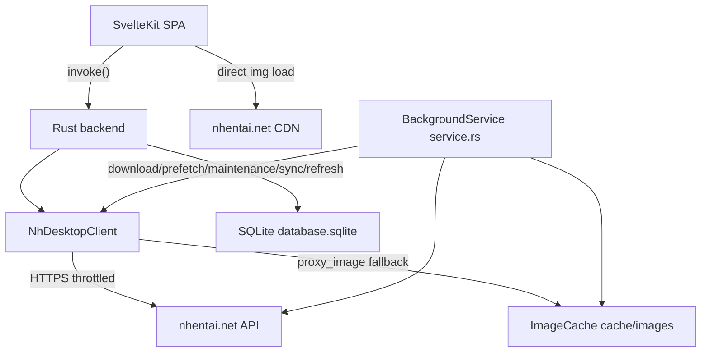

  <label for="translate-select" style="font-size:12px; color:#a1a1aa; margin-right:6px;">🌐 Language:</label>
  <select id="translate-select" style="background:#18181b; color:#f4f4f5; border:1px solid #3f3f46; border-radius:6px; padding:4px 8px; font-size:12px; cursor:pointer;" onchange="translatePage(this.value)">
    <option value="en">English</option>
    <option value="ja">日本語 (Japanese)</option>
    <option value="zh-CN">简体中文 (Simplified Chinese)</option>
    <option value="zh-TW">繁體中文 (Traditional Chinese)</option>
    <option value="ko">한국어 (Korean)</option>
    <option value="es">Español (Spanish)</option>
    <option value="fr">Français (French)</option>
    <option value="de">Deutsch (German)</option>
    <option value="ru">Русский (Russian)</option>
    <option value="pt">Português (Portuguese)</option>
    <option value="it">Italiano (Italian)</option>
    <option value="th">ไทย (Thai)</option>
    <option value="vi">Tiếng Việt (Vietnamese)</option>
    <option value="id">Bahasa Indonesia (Indonesian)</option>
    <option value="pl">Polski (Polish)</option>
    <option value="nl">Nederlands (Dutch)</option>
    <option value="tr">Türkçe (Turkish)</option>
    <option value="ar">العربية (Arabic)</option>
  </select>
  

---

> **[Documentation](README.md)** / **Architecture**
>
> 🧭 **Navigation:** [Getting Started](Getting-Started.md) · [Installation](Installation-and-Maintenance.md) · [Search & Filters](Search-and-Filters.md) · [Blacklist](Blacklist.md) · [Settings](Settings-and-API-Key.md) · [Architecture](Architecture.md) · [All Docs](README.md)

---

# Architecture

High-level picture of how the app is built and why.

Here's the shape of the whole system — SvelteKit on top, Rust under it, nhentai.net below:

Rust owns all networking and local data; the SPA only renders. Images load straight from the
CDNs, with Rust as the proxy fallback — served from the on-disk image cache
(`cache/images`) when present. A background service (`service.rs`) runs a throttled worker
queue for gallery downloads, image prefetch, cache/image maintenance, account sync, and
periodic Popular refreshes.

## 🏗️ Design decisions

1. ✅ **Cross-platform shell = Tauri 2.** Rust backend owns all networking and persistence; the SPA is
   presentation. Supports Windows, macOS, Linux, and Android. iOS is not supported.
2. **Native packaging & uninstaller.** Built with Tauri's native packaging toolchain:
   NSIS (`.exe`) with dual per-user and per-machine scopes, enterprise WiX MSI (`.msi`), DMG, deb, AppImage, APK, and portable zip.
3. **Local-first.** No server, no accounts required. Favorites/history/blacklist/settings and
   the cache live on-device in an ambiguous `database.sqlite` database; an optional nhentai.net API key adds account sync.
4. **Images = direct + proxy fallback, URLs derived from the API.** URLs are built from the
   API's relative path fragments (`image.ts` `pagePath` / `thumbPath` / `avatarUrl`); ``
   loads from the `*.nhentai.net` CDNs first, and `proxy_image` (Rust, served from the disk
   image cache `cache/images`) returns bytes → `blob:` URL if the CDN 404s.
5. **Blacklist is two layers.** Server-side `-tag:` excludes in every query, plus client-side
   hide/blur in grids, plus a master toggle. See [Blacklist](Blacklist.md).
6. **Plain CSS tokens, native titlebar & floating navigation.** Custom design system in `src/lib/design/tokens.css` + `app.css` adhering strictly to nhentai's dark palette (`#141414` / `#1f1f1f` / `#ed2553`), native OS window decorations with an in-app `.top-bar`, and a floating Mihon-style bottom navigation bar with a 4px corner radius and Dynamic UI Scaling.
7. **Official archive downloads & background services.** `service.rs` leverages nhentai API v2's dedicated archive endpoint (`POST /api/v2/galleries/{id}/download`) to download pre-built ZIP/CBZ archives directly with streaming progress, falling back gracefully to page assembly if unauthenticated. The worker queue also manages image prefetch, cache/image maintenance, account sync, and periodic Popular refreshes with job persistence across restarts in `database.sqlite` (`downloads:jobs`).
8. **Configurable storage budget & LRU image cache.** `image_cache.rs` stores fetched images under `cache/images`. Background service evicts oldest files down to 85% of user-configured budget (500 MB to Unlimited) and runs SQLite `VACUUM` compaction.
9. **Dual-mode account authentication.** Dedicated `LoginModal.svelte` supports both official API Keys (recommended, Cloudflare-safe) and direct credentials (`POST /api/v2/auth/login`), backed by reactive Svelte 5 runes getters in `account.svelte.ts` for live username and avatar rendering.

## ⚡ Frontend → Backend contract

- ⚡ Frontend calls typed commands through `src/lib/client.ts` (a thin `invoke()` wrapper) and
  `src/lib/api.ts` (the higher-level typed API surface).
- Command names are snake_case (`fetch_new`, `search_galleries`, `proxy_image`, `get_storage_stats`, …); the full
  list lives in [Backend (Rust)](Backend-Rust.md).
- Background jobs use the `service_*` commands (`service_enqueue_download`, …) and stream
  progress to the SPA as `service://job` / `service://refresh` Tauri events.
- Errors cross the bridge as `Result<_, String>` (never Rust panics) and render as friendly
  notice components.

## 🦀 Backend → nhentai.net

- 🦀 All requests go through `NhDesktopClient` (reqwest, `rustls`, gzip). A `THROTTLE` delay
  between requests respects the site's public API (see `nh_desktop.rs`). No hammering. Ever.
- Type-accurate serde models mirror the API JSON.

## 💾 Persistence model

| Store | Location | Purpose |
| --- | --- | --- |
| Favorites / history / blacklist / settings | `database.sqlite` (SQLite `kv` table) | user state, runes-backed |
| Cache mirror + API key | `database.sqlite` (SQLite) | fast startup, offline-ish lists, key at-rest |
| Download jobs | `database.sqlite` (`downloads:jobs`) | persistent queue surviving app restarts |
| Image cache | `cache/images` (data dir) | disk cache backing `proxy_image`, pruned by LRU maintenance |
| Downloads | `downloads/` (data dir) | ZIP/CBZ archives from background-service downloads |

## 🤝 Related pages

- [Backend (Rust)](Backend-Rust.md) · [Frontend (SvelteKit)](Frontend-SvelteKit.md) ·
  [Installation & Maintenance](Installation-and-Maintenance.md) · [Security](Security.md) · [Privacy](Privacy.md)

---

### 📚 Documentation Index
- **Core**: [Home](README.md) · [Getting Started](Getting-Started.md) · [Installation & Maintenance](Installation-and-Maintenance.md)
- **App Features**: [Search & Filters](Search-and-Filters.md) · [Blacklist](Blacklist.md) · [Favorites & History](Favorites-and-History.md) · [Reader & Galleries](Reader-and-Galleries.md) · [Settings & API Key](Settings-and-API-Key.md) · [Localization](Localization.md)
- **Architecture & Development**: [Architecture](Architecture.md) · [Backend (Rust)](Backend-Rust.md) · [Frontend (SvelteKit)](Frontend-SvelteKit.md) · [Packaging & Bundling](Installer-Engine.md) · [Development & Contributing](Development-and-Contributing.md)
- **Reference**: [Security](Security.md) · [Privacy](Privacy.md) · [Troubleshooting](Troubleshooting.md) · [FAQ](FAQ.md)

---

*[NH Reader](https://github.com/HELIX-Origin/NH-Reader) — a lightweight, modern, cross-platform client for nhentai.net.*

*[Documentation Home](README.md) · [Repository](https://github.com/HELIX-Origin/NH-Reader) · [Releases](https://github.com/HELIX-Origin/NH-Reader/releases) · [Security](Security.md) · [Privacy](Privacy.md) · [TOS](https://github.com/HELIX-Origin/NH-Reader/blob/main/TOS.md) · [License](https://github.com/HELIX-Origin/NH-Reader/blob/main/LICENSE.md)*
