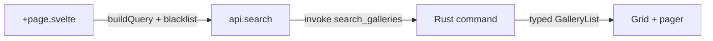

---

> **[Documentation](README.md)** / **Frontend (SvelteKit)**
>
> 🧭 **Navigation:** [Getting Started](Getting-Started.md) · [Installation](Installation-and-Maintenance.md) · [Search & Filters](Search-and-Filters.md) · [Blacklist](Blacklist.md) · [Settings](Settings-and-API-Key.md) · [Architecture](Architecture.md) · [All Docs](README.md)

---

# Frontend (SvelteKit)

The entire UI is a static SvelteKit SPA (no SSR) running inside a Tauri 2 WebView. Stack:
**Svelte 5 runes**, **TypeScript strict**, **plain CSS design tokens** (no framework), and **Dynamic UI Scaling**.

## 🧩 Source layout

```
src/lib/
  api.ts            typed higher-level API surface (search, lists, gallery, …)
  client.ts         thin invoke() wrapper for Tauri commands (snake_case)
  types.ts          shared types mirroring serde models (Gallery, Tag, SettingsState, LoginRequest, …)
  query.ts          buildQuery() → nhentai search syntax + SORT_OPTIONS
  cache.ts          SQLite-backed KV cache (prefix 'nh-reader:' -> database.sqlite)
  exportImport.ts   zero-dependency JSON export/import for library and blacklist
  image.ts          URL helpers (IMAGE_HOST/THUMB_HOST/AVATAR_HOST) +
                    pagePath()/thumbPath()/avatarUrl() + proxiedBlobUrl()
  format.ts         display helpers (sizes, dates, counts)
  i18n/             LocaleCatalog, en.json (default), drop-in community packs
  stores/           runes state (favorites/history/blacklist/settings/account/service/locale)
  components/       GalleryCard, GalleryGrid, FilterPanel, ReaderImage,
                    CoverImage, Pager, Loader, Drawer, TagChip, EmptyState,
                    ErrorNotice, SettingsView, FavoritesView, HistoryView,
                    BlacklistView, DownloadButton, Icon, LoginModal
  design/           tokens.css (palette/spacing/radius/type), base.css (reset/buttons),
                    app.css (components, top bar, floating nav, responsive styles)

src/routes/
  +layout.svelte    app shell: in-app top bar, quick-search, account chip + LoginModal, floating Mihon bottom nav
  +page.svelte      Latest (new releases, paginated)
  popular/          Popular
  downloads/        Downloads management & persistent worker queue
  favorites/  history/  blacklist/  settings/
  search/           search bar + FilterPanel drawer + results grid
  gallery/[id]/     gallery detail (+ actions, related, tags, download)
  gallery/[id]/reader/   paged/strip reader
```

## ⚡ Conventions

- ⚡ **Kebab-case** for TS/JS modules and route files; **PascalCase** for Svelte component
  files (`GalleryCard.svelte`) and component names.
- **Svelte 5 runes** (`$state`, `$derived`, `$effect`) — no legacy stores for UI state.
- The SQLite-backed KV cache (`src/lib/cache.ts` → `database.sqlite`) backs
  favorites/history/blacklist/settings; runes hydrate/serialize via the `stores/` modules
  (cache keys use the `nh-reader:` prefix with automated migration from legacy names).
- All async reads go through the typed `api`/`client` layer; never raw `invoke` in components.
- Image URLs are derived from the API's relative path fragments via `image.ts`
  (`pagePath` / `thumbPath` / `avatarUrl`); images render direct from the `*.nhentai.net` CDNs
  and fall back to a `blob:` URL from `proxy_image` (served from the disk image cache) when the
  CDN 404s (see [Reader & Galleries](Reader-and-Galleries.md)).

## 📐 Dynamic UI Scaling

[`GalleryGrid.svelte`](https://github.com/HELIX-Origin/NH-Reader/blob/main/src/lib/components/GalleryGrid.svelte) dynamically measures its container width (`bind:clientWidth={containerWidth}`) and computes optimal columns:
- Automatically calculates `cols` so card aspect ratios remain clean.
- Fits visible cards per page to complete rows (`Math.floor(visible.length / cols) * cols`), eliminating orphaned cards and empty slots.
- Fluidly scales cards across available horizontal width via CSS Grid `repeat(var(--grid-cols, 5), minmax(0, 1fr))`.
- Toggleable via the **Dynamic UI scaling** setting in Settings.

## 🔍 Event flow (example: search)

The chain is short — four hops from page to grid:



In full:

1. 🔍 `search/+page.svelte` builds a `FilterModel` → `buildQuery(model)` + blacklist excludes →
   `api.search(query, sort, page)`.
2. `client.ts` calls `invoke('search_galleries', { query, sort, page })`.
3. Rust returns `GalleryList` (typed); grid + pager render; `ErrorNotice` shows failures.

## 🔄 Background services

`src/lib/stores/service.svelte.ts` surfaces the Rust background service (`service.rs`): a
throttled worker queue for gallery downloads (ZIP/CBZ to disk), image prefetch, cache/image
maintenance, account sync, and periodic Popular auto-refresh. It listens for the
`service://job` / `service://refresh` Tauri events, persists download state across restarts in SQLite (`downloads:jobs`), and renders live progress in **Downloads** and **Settings → Background services**.

## 🎨 Design system & Shell

Tokens live in `design/tokens.css` strictly adhering to nhentai's dark palette:
- Surface / Background: `#141414` (body bg) and `#1f1f1f` (elevated surface & cards)
- Accent: `#ed2553` (nhentai brand magenta) with hover `#ee4972` and soft highlights
- Text: `#f0f0f0` (primary), `#d9d9d9` (soft), `#a8a8a8` (secondary), and `#858585` (faint, WCAG AA compliant)
- Shell & Navigation:
  - Native window title bar with native window management.
  - Dedicated in-app `.top-bar` housing branding, quick search, blacklist badge, and account login triggers.
  - Floating Mihon-style bottom navigation bar with a 4px corner radius, elevated backdrop blur, and 84px content bottom padding.
  - Full-width settings layout: Settings cards dynamically fit the full width of the container (`width: 100%`) rather than constraining to a narrow column.

## 🤝 Related

- [Architecture](Architecture.md) · [Backend (Rust)](Backend-Rust.md) ·
  [Reader & Galleries](Reader-and-Galleries.md)

---

### 📚 Documentation Index
- **Core**: [Home](README.md) · [Getting Started](Getting-Started.md) · [Installation & Maintenance](Installation-and-Maintenance.md)
- **App Features**: [Search & Filters](Search-and-Filters.md) · [Blacklist](Blacklist.md) · [Favorites & History](Favorites-and-History.md) · [Reader & Galleries](Reader-and-Galleries.md) · [Settings & API Key](Settings-and-API-Key.md) · [Localization](Localization.md)
- **Architecture & Development**: [Architecture](Architecture.md) · [Backend (Rust)](Backend-Rust.md) · [Frontend (SvelteKit)](Frontend-SvelteKit.md) · [Packaging & Bundling](Installer-Engine.md) · [Development & Contributing](Development-and-Contributing.md)
- **Reference**: [Security](Security.md) · [Privacy](Privacy.md) · [Troubleshooting](Troubleshooting.md) · [FAQ](FAQ.md)

---

*[NH Reader](https://github.com/HELIX-Origin/NH-Reader) — a lightweight, modern, cross-platform client for nhentai.net.*

*[Documentation Home](README.md) · [Repository](https://github.com/HELIX-Origin/NH-Reader) · [Releases](https://github.com/HELIX-Origin/NH-Reader/releases) · [Security](Security.md) · [Privacy](Privacy.md) · [TOS](https://github.com/HELIX-Origin/NH-Reader/blob/main/TOS.md) · [License](https://github.com/HELIX-Origin/NH-Reader/blob/main/LICENSE.md)*
