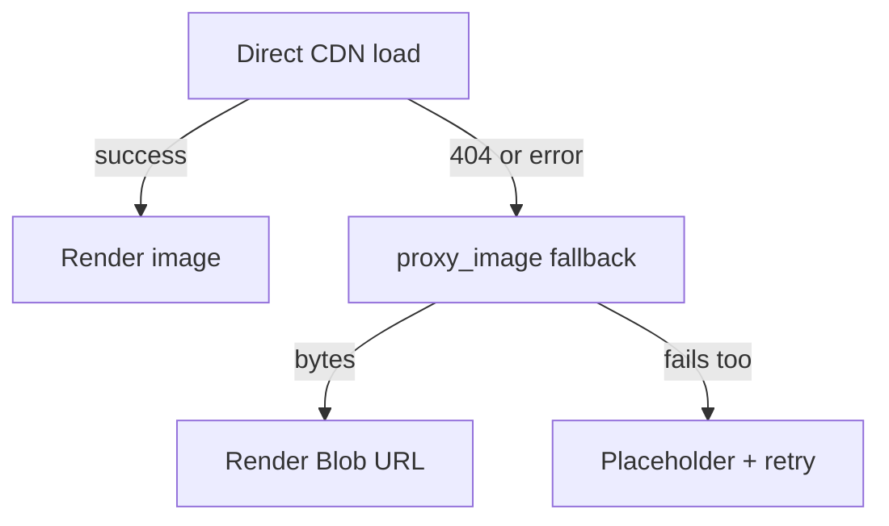

🌐 Translate this page

<a href="https://helix-origin.github.io/NH-Reader/Reader-and-Galleries.html?lang=en" lang="en">English</a> 
<a href="https://helix-origin.github.io/NH-Reader/Reader-and-Galleries.html?lang=ja" lang="ja">日本語 (Japanese)</a> 
<a href="https://helix-origin.github.io/NH-Reader/Reader-and-Galleries.html?lang=zh-CN" lang="zh-CN">简体中文 (Simplified Chinese)</a> 
<a href="https://helix-origin.github.io/NH-Reader/Reader-and-Galleries.html?lang=zh-TW" lang="zh-TW">繁體中文 (Traditional Chinese)</a> 
<a href="https://helix-origin.github.io/NH-Reader/Reader-and-Galleries.html?lang=ko" lang="ko">한국어 (Korean)</a> 
<a href="https://helix-origin.github.io/NH-Reader/Reader-and-Galleries.html?lang=es" lang="es">Español (Spanish)</a> 
<a href="https://helix-origin.github.io/NH-Reader/Reader-and-Galleries.html?lang=fr" lang="fr">Français (French)</a> 
<a href="https://helix-origin.github.io/NH-Reader/Reader-and-Galleries.html?lang=de" lang="de">Deutsch (German)</a> 
<a href="https://helix-origin.github.io/NH-Reader/Reader-and-Galleries.html?lang=ru" lang="ru">Русский (Russian)</a> 
<a href="https://helix-origin.github.io/NH-Reader/Reader-and-Galleries.html?lang=pt" lang="pt">Português (Portuguese)</a> 
<a href="https://helix-origin.github.io/NH-Reader/Reader-and-Galleries.html?lang=it" lang="it">Italiano (Italian)</a> 
<a href="https://helix-origin.github.io/NH-Reader/Reader-and-Galleries.html?lang=th" lang="th">ไทย (Thai)</a> 
<a href="https://helix-origin.github.io/NH-Reader/Reader-and-Galleries.html?lang=vi" lang="vi">Tiếng Việt (Vietnamese)</a> 
<a href="https://helix-origin.github.io/NH-Reader/Reader-and-Galleries.html?lang=id" lang="id">Bahasa Indonesia (Indonesian)</a> 
<a href="https://helix-origin.github.io/NH-Reader/Reader-and-Galleries.html?lang=pl" lang="pl">Polski (Polish)</a> 
<a href="https://helix-origin.github.io/NH-Reader/Reader-and-Galleries.html?lang=nl" lang="nl">Nederlands (Dutch)</a> 
<a href="https://helix-origin.github.io/NH-Reader/Reader-and-Galleries.html?lang=tr" lang="tr">Türkçe (Turkish)</a> 
<a href="https://helix-origin.github.io/NH-Reader/Reader-and-Galleries.html?lang=ar" lang="ar">العربية (Arabic)</a> 

---

> **[Documentation](README.md)** / **Reader & Galleries**
>
> 🧭 **Navigation:** [Getting Started](Getting-Started.md) · [Installation](Installation-and-Maintenance.md) · [Search & Filters](Search-and-Filters.md) · [Blacklist](Blacklist.md) · [Settings](Settings-and-API-Key.md) · [Architecture](Architecture.md) · [All Docs](README.md)

---

# Reader & Galleries

The gallery detail page and the reader are where you actually consume content. Both use the
Rust backend for metadata and direct image loading with a Rust-side fallback.

## 🖼️ Detail page

**Route:** `/gallery/[id]`

- 🖼️ **Header:** cover, title (original English/pretty joined), artist(s), parody, language,
  category, page count, upload age, score.
- **Actions:**
  - **Open reader** — start paging through the gallery.
  - **Download (ZIP / CBZ)** — enqueues an archive download to the background worker. Prioritizes the official dedicated archive endpoint (`POST /api/v2/galleries/{id}/download?format={format}`) per API v2 documentation, with live progress and automatic fallback to page assembly.
  - **Favorite / Unfavorite** — see [Favorites & History](Favorites-and-History.md).
  - **Open on nhentai.net** — external browser (system opener).
  - **Quick-add blacklist** — blacklist a tag or the artist right from the page
    (see [Blacklist](Blacklist.md)).
- **Tag clouds:** grouped by type (tag, artist, character, parody, group, language, category).
  Clicking a tag navigates to that tag's gallery list — as anywhere, **the [blacklist](Blacklist.md)
  is applied**.
- **Related galleries:** the site's "related" list renders as a compact grid.

## 🖼️ Reader

**Route:** `/gallery/[id]/reader`

One page at a time; arrow keys, click zones (page back when clicking in the left ~28%, forward
in the right ~72%), and the thumbnail strip change pages. The toolbar's **fit mode** cycles how
a single page is sized:

| Fit mode | Behavior |
| --- | --- |
| **Width** | Page fills the stage width; scroll vertically (stage overflow) when taller than the stage. |
| **Height** | Page fills the stage height; scroll horizontally when wider than the stage. |
| **Contain** | Whole page fit inside both axes (letterboxed; nothing is cropped). |

Other reader features:

- 🖼️ **Thumbnail strip** — jump to any page.
- **Preload distance** — configurable buffering (1, 2, 3, or 5 pages) ahead and behind for instant page turns without delays. Configurable in Settings.
- **Image quality selector** — choose between **Original (High)** for maximum detail or **Data Saver** for compressed preview images on metered or slow connections. Toggleable via toolbar button or `Q` shortcut, and in Settings.
- **Fullscreen** — expand the reader to fill the window.
- **Progress** remembered — the reader resumes where you left off (local persistence; part of
  history tracking).
- **Image fallback** — each page tries the CDN directly; on a 404/failure it re-fetches via
  the Rust `proxy_image` command (served from the disk image cache `cache/images` when present)
  and renders a `blob:` URL. Legacy galleries whose CDN re-encoded images (a known quirk) are
  handled gracefully with a placeholder + retry.

### 🖼️ Reader data

- 🖼️ Image URLs are derived from the API's relative path fragments — the API returns paths
  like `galleries/<id>/thumb.webp` *without* a leading slash, and `image.ts` joins them onto
  the right host (`https://i.nhentai.net` pages, `https://t.nhentai.net` thumbs,
  `https://static.nhentai.net` avatars).
- Hosts are always loadable because of the [CSP](https://github.com/HELIX-Origin/NH-Reader/blob/main/README.md) allow-list
  (`img-src 'self' data: blob: https://nhentai.net https://*.nhentai.net`).

## 🖼️ Image loading pipeline

Each image follows a three-hop fallback chain:

1. 🖼️ **Direct load** — `` or `https://i.nhentai.net/...`.
2. **Proxy fallback** — `CoverImage`/`ReaderImage` (`src/lib/image.ts`) catch load errors and
   call `backend.proxyImage(url)` → Rust `proxy_image` command → bytes (served from the disk
   image cache first, else fetched and cached) → `Blob` URL.
3. **Placeholder** — a quiet placeholder keeps layout stable while a card/reader image loads.

## 🤝 Related

- [Architecture](Architecture.md) — where these pieces live
- [Favorites & History](Favorites-and-History.md) — opening a gallery records history

---

### 📚 Documentation Index
- **Core**: [Home](README.md) · [Getting Started](Getting-Started.md) · [Installation & Maintenance](Installation-and-Maintenance.md)
- **App Features**: [Search & Filters](Search-and-Filters.md) · [Blacklist](Blacklist.md) · [Favorites & History](Favorites-and-History.md) · [Reader & Galleries](Reader-and-Galleries.md) · [Settings & API Key](Settings-and-API-Key.md) · [Localization](Localization.md)
- **Architecture & Development**: [Architecture](Architecture.md) · [Backend (Rust)](Backend-Rust.md) · [Frontend (SvelteKit)](Frontend-SvelteKit.md) · [Packaging & Bundling](Installer-Engine.md) · [Development & Contributing](Development-and-Contributing.md)
- **Reference**: [Security](Security.md) · [Privacy](Privacy.md) · [Troubleshooting](Troubleshooting.md) · [FAQ](FAQ.md)

---

*[NH Reader](https://github.com/HELIX-Origin/NH-Reader) — a lightweight, modern, cross-platform client for nhentai.net.*

*[Documentation Home](README.md) · [Repository](https://github.com/HELIX-Origin/NH-Reader) · [Releases](https://github.com/HELIX-Origin/NH-Reader/releases) · [Security](Security.md) · [Privacy](Privacy.md) · [TOS](https://github.com/HELIX-Origin/NH-Reader/blob/main/TOS.md) · [License](https://github.com/HELIX-Origin/NH-Reader/blob/main/LICENSE.md)*
