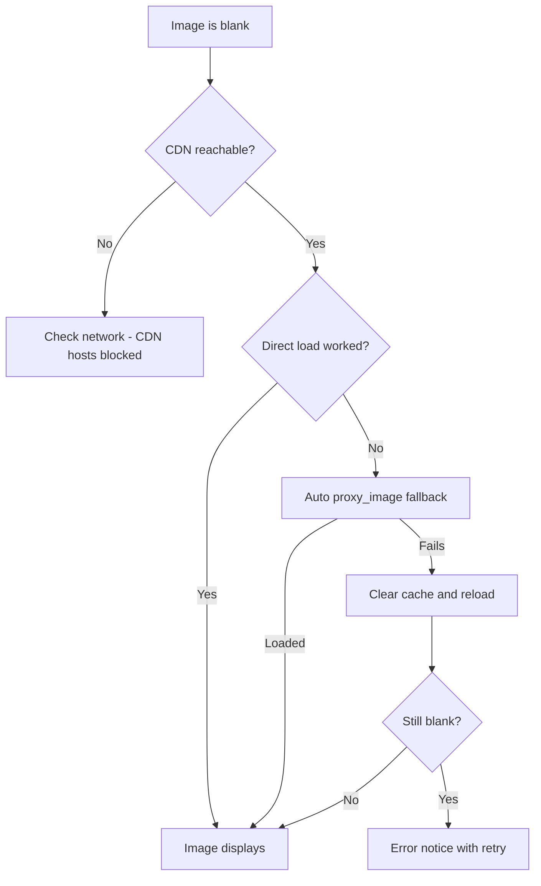

---

> **[Documentation](README.md)** / **Troubleshooting**
>
> 🧭 **Navigation:** [Getting Started](Getting-Started.md) · [Installation](Installation-and-Maintenance.md) · [Search & Filters](Search-and-Filters.md) · [Blacklist](Blacklist.md) · [Settings](Settings-and-API-Key.md) · [Architecture](Architecture.md) · [All Docs](README.md)

---

# Troubleshooting

Common problems and fixes. If the same issue persists after these steps, open a GitHub issue
with the steps you took and the relevant log/error text.

## 📦 Installation & Startup

### 🚨 "The app won't install or launch"

- On Windows, install the latest NSIS (`NH Reader_<version>_x64-setup.exe`) or WiX MSI package. If upgrading, ensure any running instance of NH Reader is closed first.
- On macOS, drag `NH Reader.app` into `/Applications`. If Gatekeeper blocks the app because of ad-hoc signing, control-click the app in Finder and choose **Open**.
- On Linux, install the `.deb` package via `sudo dpkg -i nh-reader_<version>_amd64.deb` or ensure the AppImage has execute permissions (`chmod +x nh-reader_*.AppImage`).
- For portable mode, ensure the `.portable` file or `data/` folder is present in the executable's folder.

## 🔑 Account & Authentication

### 🚨 "Login failed with username and password"

- Cloudflare bot protection on nhentai.net frequently challenges direct credential POST requests (`POST /api/v2/auth/login`).
- **Solution:** Use an **Official API Key** instead. Head to nhentai.net → *Settings → API Key*, copy the key, open the NH Reader Login Modal (via top bar or Settings), and paste it into the **API Key** tab. API keys are officially supported and completely bypass Cloudflare CAPTCHAs.

### 🚨 "Account favorites or blacklist not syncing"

- Verify your API key or token by clicking **Verify** in Settings.
- Check network connectivity to `https://nhentai.net`.

## 🖼️ Loading & Images

### 🚨 Galleries load but images are blank

- Check your network: nhentai.net's CDN hosts (`t.nhentai.net`, `i.nhentai.net`, `static.nhentai.net`) must be reachable.
- Some legacy galleries 404 on the CDN. The app auto-falls back to its image proxy (`proxy_image` → `blob:`, served from the on-disk image cache `cache/images`). If that still fails, the UI shows a retry button.
- **Settings → Storage & Cache**: Use **Clear image cache** or **Optimize storage** to refresh corrupted images.

Stuck on blank images? Follow this decision tree:

### 🚨 "Network error" or timeouts

- nhentai.net rate-limits aggressive traffic. The app throttles requests, but rapid pagination or bulk downloading can temporarily trigger upstream limits. Wait a moment and retry.

## 🔍 Search & Filters

### 🚨 "Search returns wrong / no results"

- Check query syntax (see [Search & Filters](Search-and-Filters.md)): exclusions require the `-` prefix (`-tag:loli`, `tag:female`, `artist:hana`, `language:english`, `pages:>50`).
- The blacklist is applied **server-side** to search queries. If search returns no results, a matching blacklisted tag may be filtering out all candidates. Toggle the top-bar blacklist badge off to test.

## ⭐ Favorites, History & Blacklist

### 🚨 "My favorites or blacklist disappeared"

- Favorites, history, and blacklist are stored in `database.sqlite`. If you perform a clean wipe of `%LOCALAPPDATA%\NH Reader` (or local `data/` in portable mode), local storage will reset.
- **Backup & Restore:** Use the 1-click **Export Favorites** and **Export Blacklist** buttons in Settings / Library / Blacklist views to save your data to JSON. You can import your JSON backup at any time.

## 🔗 Related

- [Getting Started](Getting-Started.md) · [FAQ](FAQ.md) ·
  [Search & Filters](Search-and-Filters.md) · [Privacy](Privacy.md)

---

### 📚 Documentation Index
- **Core**: [Home](README.md) · [Getting Started](Getting-Started.md) · [Installation & Maintenance](Installation-and-Maintenance.md)
- **App Features**: [Search & Filters](Search-and-Filters.md) · [Blacklist](Blacklist.md) · [Favorites & History](Favorites-and-History.md) · [Reader & Galleries](Reader-and-Galleries.md) · [Settings & API Key](Settings-and-API-Key.md) · [Localization](Localization.md)
- **Architecture & Development**: [Architecture](Architecture.md) · [Backend (Rust)](Backend-Rust.md) · [Frontend (SvelteKit)](Frontend-SvelteKit.md) · [Packaging & Bundling](Installer-Engine.md) · [Development & Contributing](Development-and-Contributing.md)
- **Reference**: [Security](Security.md) · [Privacy](Privacy.md) · [Troubleshooting](Troubleshooting.md) · [FAQ](FAQ.md)

---

*[NH Reader](https://github.com/HELIX-Origin/NH-Reader) — a lightweight, modern, cross-platform client for nhentai.net.*

*[Documentation Home](README.md) · [Repository](https://github.com/HELIX-Origin/NH-Reader) · [Releases](https://github.com/HELIX-Origin/NH-Reader/releases) · [Security](Security.md) · [Privacy](Privacy.md) · [TOS](https://github.com/HELIX-Origin/NH-Reader/blob/main/TOS.md) · [License](https://github.com/HELIX-Origin/NH-Reader/blob/main/LICENSE.md)*
