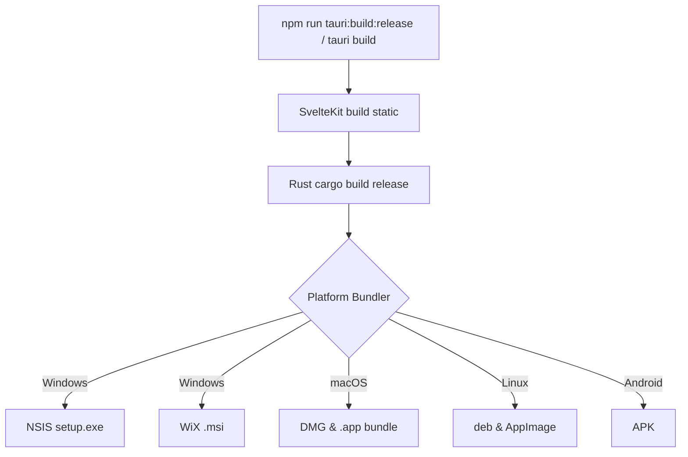

# Packaging & Installer Architecture

NH Reader utilizes **Tauri v2 Native Packaging** (`tauri build`) for local builds of Windows, macOS, Linux, Android, and iOS packages. Packages are not signed or published by CI; there is no automated packaging workflow. iOS builds require macOS, Xcode, and Apple signing credentials.

## 🧭 Why Native Packaging Over Custom Installers

In earlier versions, a custom embedded installer was evaluated. However, custom installers in Tauri v2 present significant architectural challenges:
1. **Asset & Webview Bundling**: Native packaging automatically links and bundles frontend static assets, webview loaders, and platform runtime dependencies into the output binary package.
2. **Elevation & UAC**: Windows User Account Control (UAC) handling during custom installs often causes file-locking collisions and permission errors when updating program files.
3. **Uninstallation & System Registry**: Native installers (NSIS and WiX) manage system uninstaller registrations, start menu entries, and desktop shortcuts cleanly through standard OS facilities.
4. **Mobile & Cross-Platform Alignment**: Tauri's native packaging toolchain cleanly supports Android APK packaging alongside desktop installers.

---

## 📦 Bundling Pipeline



### Build Commands

```bash
# Desktop release build (bundles NSIS, WiX MSI, DMG, or deb/AppImage)
npm run tauri:build:release

# Debug desktop build (unoptimized, useful for rapid testing)
npm run tauri:build:debug

# Android mobile build pipeline
npm run tauri:android:init    # initialize Android studio project
npm run tauri:android:build   # compile standalone APK
```

---

## ⚙️ Configuration (`src-tauri/tauri.conf.json`)

Packaging is configured under the `bundle` key in `src-tauri/tauri.conf.json`:

```json
"bundle": {
  "active": true,
  "targets": "all",
  "icon": [
    "icons/32x32.png",
    "icons/128x128.png",
    "icons/128x128@2x.png",
    "icons/icon.icns",
    "icons/icon.ico"
  ],
  "windows": {
    "certificateThumbprint": null,
    "digestAlgorithm": "sha256",
    "timestampUrl": "",
    "nsis": {
      "installMode": "both",
      "installerIcon": "icons/icon.ico",
      "headerImage": null,
      "sidebarImage": null,
      "languages": ["English"]
    },
    "wix": {
      "language": "en-US"
    }
  },
  "macOS": {
    "dmg": {
      "windowSize": { "width": 600, "height": 400 },
      "appPosition": { "x": 180, "y": 170 },
      "applicationFolderPosition": { "x": 420, "y": 170 }
    }
  }
}
```

---

## 🎨 Customizing NSIS & WiX Installers

Tauri v2 allows deep customization of Windows installers without breaking native stability:

1. **NSIS Installation Mode (`installMode: "both"`)**:
   - Gives the user a choice between "Install for anyone who uses this computer (all users)" or "Install just for me (current user)".
2. **Visual Assets**:
   - `headerImage`: 150x57 BMP header graphic displayed during installation. *(Not used by NH Reader: the composed wide banner renders as a small left-aligned top-bar graphic in NSIS, so the option was removed from our config.)*
   - `sidebarImage`: 164x314 BMP graphic displayed on the Welcome and Finish wizard pages. *(The only visual asset NH Reader uses: `src-tauri/windows/sidebar.bmp`.)*
3. **Custom NSIS Hooks (`customLanguageFiles`, custom `.nsh` includes)**:
   - For custom registry entries, environment variables, or custom styling.
4. **WiX Templates**:
   - For corporate deployment, custom `.wxs` fragments can be injected into the WiX MSI compilation.

---

- Related: [Installation & Maintenance](Installation-and-Maintenance.md) · [Architecture](Architecture.md) · [Security](Security.md)

---

### 📚 Documentation Index
- **Core**: [Home](README.md) · [Getting Started](Getting-Started.md) · [Installation & Maintenance](Installation-and-Maintenance.md)
- **App Features**: [Search & Filters](Search-and-Filters.md) · [Blacklist](Blacklist.md) · [Favorites & History](Favorites-and-History.md) · [Reader & Galleries](Reader-and-Galleries.md) · [Settings & API Key](Settings-and-API-Key.md) · [Localization](Localization.md)
- **Architecture & Development**: [Architecture](Architecture.md) · [Backend (Rust)](Backend-Rust.md) · [Frontend (SvelteKit)](Frontend-SvelteKit.md) · [Packaging & Bundling](Installer-Engine.md) · [Development & Contributing](Development-and-Contributing.md)
- **Reference**: [Security](Security.md) · [Privacy](Privacy.md) · [Troubleshooting](Troubleshooting.md) · [FAQ](FAQ.md)

---

*[NH Reader](https://github.com/HELIX-Origin/NH-Reader) — a lightweight, modern, cross-platform client for nhentai.net.*

*[Documentation Home](README.md) · [Repository](https://github.com/HELIX-Origin/NH-Reader) · [Releases](https://github.com/HELIX-Origin/NH-Reader/releases) · [Security](Security.md) · [Privacy](Privacy.md) · [TOS](https://github.com/HELIX-Origin/NH-Reader/blob/main/TOS.md) · [License](https://github.com/HELIX-Origin/NH-Reader/blob/main/LICENSE.md)*
