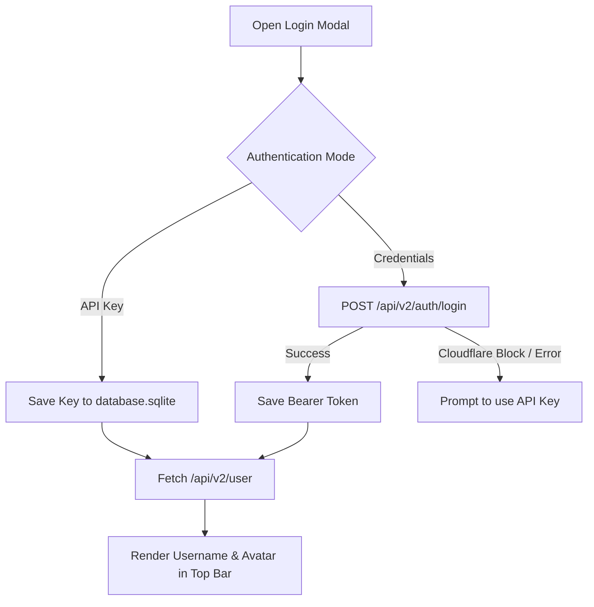

# Settings & API Key

**Route:** Settings · component `src/lib/components/SettingsView.svelte`

Settings are kept deliberately small and local. All settings persist via the SQLite-backed
KV cache (`src/lib/cache.ts` → `database.sqlite`), standardizing on nhentai's native dark palette (`#141414` / `#1f1f1f` / `#ed2553`).

## ⚙️ Appearance

- 🎨 **Palette:** Locked to nhentai.net's dark color scheme (`#141414` / `#1f1f1f` / `#ed2553`). Custom theme engines are dropped in favor of visual authenticity and lightweight performance.
- 📐 **Grid density:** `Cozy` or `Compact`.
- 📐 **Dynamic UI scaling:** Toggle automatic column calculation and full-row fitting. When active, cards fluidly expand to window width and visible items are fitted to complete rows so there is never an empty card space.
- 🌍 **Language:** Pick the interface language from the dropdown. Defaults to your system locale
  on first launch. English is provided by default — see [Localization](Localization) and
  [Contributing Translations](https://github.com/HELIX-Origin/NH-Reader/blob/main/CONTRIBUTING.md#contributing-translations) to drop in another language.

## 🗄️ Cache & Storage Management

The Storage & Cache panel provides live telemetry and automated maintenance:
- **Telemetry display**: Real-time stats on image cache disk footprint (megabytes and file count), query cache rows, and SQLite database file size.
- **Maximum storage budget**: Select disk budget caps (500 MB, 1 GB, 2 GB, 5 GB, or Unlimited). The background service automatically evicts the oldest LRU images down to 85% of budget.
- **Clear image cache**: Wipes cached cover and page images from disk.
- **Clear cached responses**: Flushes cached API search/gallery payloads from `database.sqlite` without touching favorites, blacklist, history, or settings.
- **Optimize storage**: Reclaims unused disk space by running SQLite `VACUUM`.

## 📥 Downloads Configuration

- **Download directory**: Configure custom destination folder for ZIP and CBZ archives, or restore the system default (`Documents/NH Reader/downloads`).
- **Open folder**: 1-click button to reveal downloads in the native OS file explorer.
- **Queue persistence**: Download jobs persist across app restarts and system shutdowns (`downloads:jobs` in `database.sqlite`).

## 🔑 nhentai Account (Authentication & API Key)

The app provides a dedicated **Sign In / Account** modal accessible directly from the top bar or Settings. Connecting an account is optional.

### Authentication Options

1. **Official API Key** *(Recommended)*:
   - Obtain an API key from nhentai.net → *Settings → API Key*.
   - Authenticates requests with `Authorization: Key <key>`.
   - **Bypasses Cloudflare CAPTCHAs completely** and avoids credential expiration.
2. **Account Credentials**:
   - Direct login using username and password via `POST /api/v2/auth/login`.
   - Obtains an authentication token (`Authorization: User <token>`).
   - If Cloudflare blocks the request or requests a captcha, the UI prompts you to use an API Key instead.

| Control | Behavior |
| --- | --- |
| **Sign In / Connect** | Opens `LoginModal.svelte` with tabs for API Key and Credentials. |
| **Verify / Status** | Calls nhentai.net's `/api/v2/user` (`UserMeResponse`), rendering your username, avatar, and account status in real-time. |
| **Disconnect** | Clears the stored key/token from `database.sqlite` immediately and resets account state. |

The authentication flow:

### 🔑 What authentication enables

- Account favorites sync (`check_favorite`, `add_favorite`, `remove_favorite`, `fetch_favorites`).
- Account blacklist sync (`fetch_account_blacklist`, `update_account_blacklist` via `POST /api/v2/blacklist`).
- Live account status and avatar display in the top bar. *(Note: Gallery downloads and browsing do NOT require an account).*

### 🔒 Security notes

- Keys and tokens are stored **strictly locally** (`database.sqlite`), never logged, and sent only to `nhentai.net` over HTTPS.
- Disconnecting is immediate; future requests cleanly revert to anonymous mode.

## 📱 Mobile & Sideloading

NH Reader produces native Android APKs and iOS packages via Tauri 2.

> [!CAUTION]
> **Mandatory Jailbreak Disclaimer**
> 
> NH Reader provides iOS packages primarily for Apple Silicon macOS sideloading (no jailbreak required) and personal iOS provisioning. **No technical support or warranty is provided for users who brick, damage, or compromise their devices by attempting to jailbreak their phones.** Sideloading or jailbreaking is undertaken entirely at the user's own risk.

## 🔄 Background services

Settings → **Background services** (backed by `src-tauri/src/service.rs` + the runes store
`src/lib/stores/service.svelte.ts`):

| Control | Behavior |
| --- | --- |
| **Auto-refresh Popular** | Toggle periodic Popular-list refreshes; when on, pick **15 min / 1 hour / Daily** (persisted via `service_set_auto_refresh`). |
| **Sync account** | Pulls account favorites + blacklist into the local mirror (`service_enqueue_sync`). |
| **Run maintenance** | Prunes the disk image cache (30-day images) and cached lists (7 days) (`service_enqueue_maintenance`). |
| **Recent jobs** | Live list of background jobs with progress, streamed over the `service://job` / `service://refresh` events (download, prefetch, maintenance, refresh, sync). |

The service processes jobs one at a time from a throttled queue. Downloads land in the
`downloads/` folder of the app data dir. See [Backend (Rust)](Backend-Rust) for the
`service_*` commands.

## ⚙️ Other settings surfaces

Beyond the Settings page, related persistent state lives in:

- ⚙️ `src/lib/stores/settings.svelte.ts` — user preferences
- 🌍 `src/lib/stores/locale.svelte.ts` — interface language + system-locale detection
- ⚙️ `src/lib/stores/library.svelte.ts` — favorites/history persistence
- ⚙️ `src/lib/stores/blacklist.svelte.ts` — the global blacklist + master toggle
- ⚙️ `src/lib/stores/account.svelte.ts` — account/API-key state
- ⚙️ `src/lib/stores/service.svelte.ts` — background-service jobs + auto-refresh config

## 🤝 Related

- [Search & Filters](Search-and-Filters) · [Blacklist](Blacklist)
- [Localization](Localization) — language packs and how to contribute one
- [Backend (Rust)](Backend-Rust) — the commands behind these toggles